  

 

  <video src="./assets/misc/pollito.mp4" width="160" autoplay loop muted playsinline style="border-radius: 8px; border: 1px solid #30363d;"></video>

 

  
  &nbsp;&nbsp;
  
  &nbsp;&nbsp;
  

  

  

  

  

  

  

  

  

  

  

  

  

  

  

  

  
  
  
  
  

  
  
  

  

  

  

  

