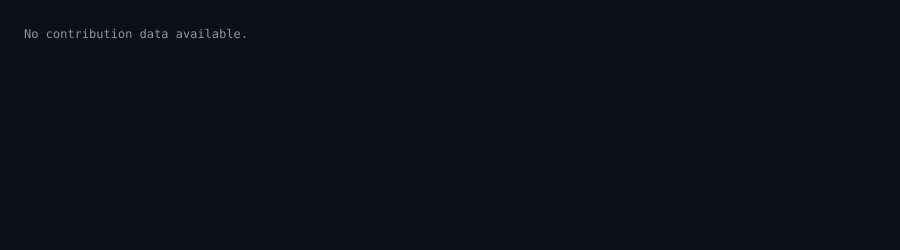

<div align="center">
  
</div>

```bash
$ ./contributions.sh
```



```bash
$ whoami
```

<table>
  <tr>
    <td width="50%"></td>
    <td width="50%"></td>
  </tr>
</table>

```bash
$ experience
```



```bash
$ tech-stack
```



```bash
$ current-streak
```

<p>
  
</p>

```bash
$ achievements
```



```bash
$ featured-projects
```



```bash
$ coding
```



```bash
$ currently
```



```bash
$ snake
```

<p align="center">
  
</p>

```bash
kavish@github:~$ exit
Session terminated successfully.
```
